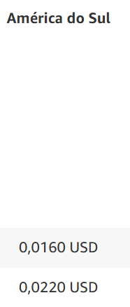

## Natalia Dias Fernandes Matrícula:202402410751
## Walquíria Gonçalves Barbosa Matrícula:202403773198
## Leticia Antunes Matrícula:202403530449

# Projeto computação em nuvem

## Serviço de nuvem utilizado: AWS

- **Por que aws:**
    - A aws é a mais popular e a que possui diversos recursos e sistema em nuvem capazes de suprir toda a demanda, e todos os requisitos que vão precisar ser utilizados pela empresa.

## Solução de controle para franquia de petshop

- **cliente liga na central e manda uma mensagem por whatsapp no atendimento para marca banho/tosa:**
    - **ponto negativo:** nem sempre estão olhando o whatsapp ou atendendo as ligações.
    - **solução:** Ter um robo de auto atendimento para realizar a triagem e depois os clientes verem se pode ser agendado o atendimento conforme as informações que o robo vai coletar como essencial. A central tem que saber direcionar o cliente para a franquia correta para realizar os agendamentos.
        - ter um sistema administrador para os clientes receber as informações e tomar ações e agendamentos.
    - **serviço aws:**  O Amazon Simple Notification Service (SNS) é um serviço da AWS que permite enviar notificações e criar aplicações utilizando o modelo de mensagens pub/sub.

- **Se o cliente muda de franquiado deverá ser feito um novo re-cadrastro mesmo que seja cliente da mesma franquia:**
    - O sistema unico de cadrastro de clientes vai permitir rastrear o cliente em vez de recria-lo e atualizar o cadastro com as informações atuais do cliente.        
    - **serviço aws:** aws cognito é um serviço da AWS que permite gerenciar contas de usuários, como criar, confirmar e visualizar atributos.

- **depois de agendado, vai para uma planilha com o nome do pet, raça, pelagem, procedimento e valor do serviço contratado, dia e horário agendado:**
    - eliminar o uso da planilha, utilizar o sistema administrador, comentado acima, com os mesmos recursos utilizados pela planilha e inclusão de melhorias: evitar agendamentos com conflitos ou em excesso para o mesmo horário e o desbalanceamento do dia e horário em questão de serviço.
    - **serviço aws:** O Amazon QuickSight é um serviço da AWS que permite a criação de painéis e visualizações interativas.

- **os serviços contratados vão estar em um checklist de papel escrito os procedimentos a serem realizados:**
    - **ponto negativo:** o checklist de papel não está proximo para os funcionários olharem e por questão de se de papel não da para acessar pois vão estar molhados e o papel pode acabar sendo estragado, nisso muitos serviços adicionais como escovação dentária, hidratação da pelagem não são informados ao funcionários e podem acabar não sendo feito e o cliente vai acabar pagando por um serviço não realizado, falta informação.
    - **solução:** ter um sistema de checklist onde o funcionário tem acesso a todos os serviços que aquele pet receberá naquele momento para nenhum ponto ser esquecido e oferecer um serviço de qualidade, com possibilidade de o funcionário colocar quais pontos já foram realizados para quando concluir o checklist o animal já está pronto para ir embora.
    - **serviço aws:** O Amazon Simple Notification Service (SNS) é um serviço da AWS que permite enviar notificações e criar aplicações utilizando o modelo de mensagens pub/sub.
O Amazon CloudFront é um serviço da Amazon Web Services (AWS) que atua como uma rede de entrega de conteúdo (CDN).

- **terminando o serviço o cliente é avisado por mensagem ou ligação para buscar seu pet:**
    - **ponto negativo:** o funcionário avisa os clientes que o pet está pronto, mas algumas vezes eles acabam esquecendo de avisar naquele momento fazendo o pet ficar mais tempo que o necesssário esperando seu tutor busca-lo.
    - **solução:** com todos os requisitos completados no checklist é disponibilizado a opção de notificar o cliente com uma mensagem utilizando o robo do whatsapp ou para outros casos deixar um alerta no sistema administrador para a recepção ligar para o cliente.
    - **serviço aws:** O Amazon Simple Notification Service (SNS) é um serviço da AWS que permite enviar notificações e criar aplicações utilizando o modelo de mensagens pub/sub.

- **o checklist é entregue para o cliente assinar e pagar pelo serviço:**
    - o sistema do checklist estará concluido no sistema em forma de aplicativo e o cliente deve dar um visto e assinar de forma digital.
    - **serviço aws:** O Amazon CloudFront é um serviço da Amazon Web Services (AWS) que atua como uma rede de entrega de conteúdo (CDN).

## Diagrama da solução usando os recursos da AWS

## Preços de serviços usados pela aws
- **cognito valores:**

- **sns valores:**

- **QuickSight:**

- **CloudFront:**
    -   Nível gratuito
    
    - Transferência regional de dados externas para a internet (por GB)
    
    - Transferência de dados regional para a origem (por GB)
    
    - Solicitar preço para todos os métodos HTTP (por cada 10.000)
    
- **EC2** 
    - Instancia medium, 1 vCPU e 4GB ram
    

## VM e containers
Será utilizado uma instancia do EC2 para hospedar uma aplicação de servidor web por exemplo:Servidor php responsável por atuar como sistema principal para as empresas de petshops e para os clientes.